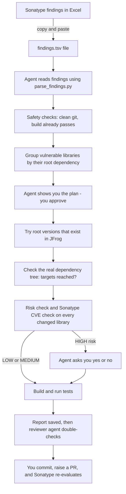

# Building a Dependency Remediation Agent in VS Code (GitHub Copilot)

### A complete, step-by-step guide for first-time agent builders

This guide walks you from an empty computer setup to a working AI agent that fixes vulnerable Java libraries in `pom.xml` (Maven) and `build.gradle` (Gradle) projects. You don't need to be a programmer. Every step says **what to do**, **why you're doing it**, and **how to check it worked** before you move on.

---

## Table of contents

- [Before you begin](#before-you-begin)
- [Part 0: How the whole thing works](#part-0-how-the-whole-thing-works)
- [Part 1: Prepare your computer (Steps 1–5)](#part-1-prepare-your-computer)
- [Part 2: Build the helper toolkit (Steps 6–12)](#part-2-build-the-helper-toolkit)
- [Part 3: Create the agents (Steps 13–17)](#part-3-create-the-agents)
- [Part 4: Use the agent on a real repo (Steps 18–22)](#part-4-use-the-agent-on-a-real-repo)
- [Part 5: Test it before you trust it (Step 23)](#part-5-test-it-before-you-trust-it)
- [Part 6: Maintenance and team rollout](#part-6-maintenance-and-team-rollout)
- [Troubleshooting](#troubleshooting)
- [Frequently asked questions](#frequently-asked-questions)
- [Appendix A: Where every file lives](#appendix-a-where-every-file-lives)
- [Appendix B: Command cheat sheet](#appendix-b-command-cheat-sheet)
- [Appendix C: Glossary](#appendix-c-glossary)

---

## Before you begin

**Time needed:** about 2–3 hours for the one-time setup, then a few minutes to start each remediation run.

**Collect these from other teams before starting:**

| What | Who usually has it | Example |
|---|---|---|
| JFrog Artifactory web address | Build / DevOps team | `https://artifactory.yourcompany.com/artifactory` |
| Name of the *virtual* Maven repository your builds use | Build / DevOps team | `maven-virtual` |
| Sonatype IQ server web address | Security / AppSec team | `https://iq.yourcompany.com` |
| Your company's Java group prefix (for in-house libraries) | Any senior developer | `com.yourcompany` |
| Permission to use GitHub Copilot on company code | Security / IT | — |

**An important note about "on-premise":** Your code, JFrog, Sonatype and builds all stay inside your network. However, GitHub Copilot's AI runs as a service hosted by GitHub, so the files and command output the agent reads are sent to that service to be processed. Most companies allow this under a Copilot Business or Enterprise licence. Confirm it's approved for your code before you start.

---

## Part 0: How the whole thing works

Read this part once. It makes every later step make sense.

### The idea in plain words

Think of the agent as a **new team member with a very strict job description**:

- **The job description** is a text file (the *agent file*) that says exactly what to do, in what order, and what never to do.
- **The team member's reference tools** are small helper programs (the *scripts*). The AI is good at reading and editing files, but it can confidently make things up, such as version numbers or CVE lists. So for every *fact*, it must ask a script, and the scripts get facts from the real systems: your Excel data, JFrog, Sonatype and the build tool itself.
- **You are the manager.** The agent shows you a plan before starting, asks your permission for anything risky, and hands you a report at the end.

### What happens during a run



### The seven rules that make the output accurate

1. **Sonatype (your Excel data) is the only source of vulnerabilities.** The AI never adds or removes CVEs from memory.
2. **The recommended version in Excel is the target.** If you fill in a target version yourself, that wins. If there's none, the agent asks you rather than guessing.
3. **JFrog confirms a version exists.** The agent can only use versions your builds can actually download.
4. **Sonatype confirms a version is safe.** Existing in JFrog doesn't mean it's free of vulnerabilities, so every version that changes is checked against Sonatype.
5. **Fix the root, not the leaves.** If one library (the "root") pulls in 20 vulnerable libraries underneath it, the agent upgrades that one root instead of forcing 20 separate versions.
6. **Versions live in property files.** In Gradle, in `gradle.properties`, never directly in `build.gradle`. In Maven, in `<properties>` in the root `pom.xml`.
7. **Risky changes need a human.** Any change likely to break the application must get your explicit "yes".

### Key words you'll see

- **Direct dependency:** a library your project lists by name in its build file.
- **Transitive dependency:** a library that comes along *inside* another library. You didn't list it, but your app still uses it.
- **Root:** the direct dependency that brings in a transitive one.
- **Parent POM / BOM:** a "master list" of versions that many libraries follow (for example Spring Boot). Changing its version changes many libraries at once.
- **Major / minor / patch:** the three parts of a version like `2.13.5` (major 2, minor 13, patch 5). Patch changes are usually safe, minor changes usually safe, major changes often break things.

A full glossary is in [Appendix C](#appendix-c-glossary).

---

## Part 1: Prepare your computer

### Step 1: Check VS Code and GitHub Copilot

**Why:** The agent runs inside VS Code's Copilot Chat. Custom agents need a recent VS Code version.

1. Open VS Code.
2. Go to **Help → About** (on Mac: **Code → About Visual Studio Code**) and note the version. If it's more than a couple of months old, install the latest version, or ask IT to.
3. Open the **Chat panel** with **Ctrl+Alt+I** (Mac: **Cmd+Ctrl+I**), or click the chat icon at the top of the window.
4. Make sure you're signed in to GitHub Copilot. If there's a sign-in button, use your company account.
5. Type `hello` and press Enter.

✅ **Check:** Copilot replies.

❗ **If not:** Ask IT to confirm your Copilot licence is active and that VS Code can reach GitHub through the company proxy.

### Step 2: Open the terminal and check the required tools

**Why:** The agent runs commands, like building the project or running the helper scripts, in VS Code's **terminal**. The terminal is a text window where you type a command and press Enter. These tools must already be installed.

1. In VS Code, go to **Terminal → New Terminal**. A panel opens at the bottom.
2. Type each command below and press Enter after each one:

```
git --version
python --version
mvn -v
java -version
```

On **Mac or Linux**, use `python3 --version` instead of `python --version`.

✅ **Check:** Each command prints a version number.

❗ **If a command says "not found" or "not recognized":**
- `python`: ask IT to install **Python 3.9 or newer**. On Windows, make sure "Add Python to PATH" is ticked during installation.
- `mvn`: only needed for Maven projects. Gradle projects include their own `gradlew` file, so no install is needed for Gradle.
- `git` or `java`: ask IT to install them.

> **Note on Windows:** VS Code's terminal on Windows uses **PowerShell** by default. All commands in this guide are written to work in PowerShell and in Mac/Linux terminals. Don't switch the terminal to "Command Prompt".

### Step 3: Get your JFrog details and save your access token

**Why:** One of the helper scripts asks JFrog which versions of a library exist. It needs a personal access token (like a password for programs). Saving it as an **environment variable** means your computer remembers it, so it's never typed into chat or saved in a file.

1. Get the **Artifactory URL** and the **virtual Maven repo name** from your build team (see [Before you begin](#before-you-begin)). Write them down; you'll need them in Step 7.
2. Log into the JFrog web page in your browser.
3. Click your **profile/user icon** → **Edit Profile** (or **Set Me Up**) → **Generate an Identity Token**. Copy the token.
4. In the VS Code terminal, run the command for your system, pasting your token between the quotes:

**Windows:**
```
setx ARTIFACTORY_TOKEN "paste-your-token-here"
```

**Mac/Linux:**
```
echo 'export ARTIFACTORY_TOKEN="paste-your-token-here"' >> ~/.zshrc
```

Windows should reply `SUCCESS: Specified value was saved.` Mac/Linux prints nothing, which is normal.

### Step 4: Get your Sonatype IQ user token

**Why:** Another helper script asks Sonatype IQ whether a version has known vulnerabilities. This answers the question "JFrog has this version, but is it actually safe?"

1. Log into the Sonatype IQ web page.
2. Click your **user name** (top right) → **User Token** → **Generate User Token**. You get two values: a **user code** and a **passcode**.
3. In the VS Code terminal, run:

**Windows:**
```
setx IQ_USER "your-user-code"
setx IQ_TOKEN "your-passcode"
```

**Mac/Linux:**
```
echo 'export IQ_USER="your-user-code"' >> ~/.zshrc
echo 'export IQ_TOKEN="your-passcode"' >> ~/.zshrc
```

> If you can't get IQ API access, the setup still works: the agent marks versions as **UNVERIFIED**, and you check them in the Sonatype web page before merging. See the [FAQ](#how-do-i-know-a-new-version-is-free-of-vulnerabilities).

### Step 5: Restart VS Code and confirm the tokens are saved

**Why:** Programs only see new environment variables after they restart.

1. **Close every VS Code window** completely, then open VS Code again.
2. Open a new terminal (**Terminal → New Terminal**) and run:

**Windows:**
```
echo $env:ARTIFACTORY_TOKEN
echo $env:IQ_USER
```

**Mac/Linux:**
```
echo $ARTIFACTORY_TOKEN
echo $IQ_USER
```

✅ **Check:** Both print your values, not a blank line.

❗ **If blank:** On Windows, check you used `setx` and fully closed VS Code. On Mac, run `source ~/.zshrc` or open a new terminal window.

> **Security tip:** Never paste tokens into Copilot Chat, and never save them inside a repository.

---

## Part 2: Build the helper toolkit

You'll create one folder in your **home folder** holding all the helper scripts. Because it lives outside any project, the same toolkit works for **every repo you clone**.

| Your system | Your home folder |
|---|---|
| Windows | `C:\Users\<your-name>` |
| Mac | `/Users/<your-name>` |
| Linux | `/home/<your-name>` |

> **Shortcut:** If someone shared a ready-made `remediation-tools` folder with you, copy it into your home folder, skip to Step 7 to edit the `CHANGE ME` lines, and then do the ✅ checks in Steps 7–12. If not, follow each step below and copy-paste the code.

### Step 6: Create the toolkit folder and open it in VS Code

1. In the VS Code terminal, run:
```
mkdir "$HOME/remediation-tools"
```
2. In VS Code, go to **File → Open Folder…**, go to your home folder, select `remediation-tools`, and click **Open** (Mac: **Select Folder**). If VS Code asks whether you trust the folder, choose **Yes, I trust the authors**.

✅ **Check:** The left sidebar shows an empty folder named `REMEDIATION-TOOLS`.

**How to create a file (you'll do this several times):** hover over the folder name in the left sidebar, click the **New File** icon (a page with a +), type the file name exactly as shown, press Enter, paste the content, then press **Ctrl+S** (Mac: **Cmd+S**) to save.

### Step 7: Create `jfrog_versions.py` (which versions exist in JFrog?)

**What it does:** Given a library name, it asks your JFrog virtual repository for the list of versions available to download. It hides test versions (alpha, beta, RC, snapshot) so the agent only sees proper releases, and sorts them oldest to newest.

**Why it matters:** This stops the agent from choosing a version number that doesn't exist or that your builds can't download.

1. Create a file named `jfrog_versions.py`.
2. Paste this code:

```python
# jfrog_versions.py - lists release versions of a library available in JFrog Artifactory
# usage: python jfrog_versions.py <groupId> <artifactId>
import os, re, sys, urllib.request

ARTIFACTORY_URL = "https://artifactory.yourcompany.com/artifactory"   # CHANGE ME
REPO = "maven-virtual"                                                 # CHANGE ME

if len(sys.argv) != 3:
    sys.exit("usage: python jfrog_versions.py <groupId> <artifactId>")
group, artifact = sys.argv[1], sys.argv[2]
token = os.environ.get("ARTIFACTORY_TOKEN")
if not token:
    sys.exit("ERROR: ARTIFACTORY_TOKEN is not set. See guide Step 3.")

url = f"{ARTIFACTORY_URL}/{REPO}/{group.replace('.', '/')}/{artifact}/maven-metadata.xml"
req = urllib.request.Request(url, headers={"Authorization": f"Bearer {token}"})
try:
    xml = urllib.request.urlopen(req, timeout=30).read().decode()
except Exception as e:
    print(f"NOT_FOUND ({e})")
    sys.exit(0)

def vkey(v):
    return [int(x) for x in re.findall(r"\d+", v)] or [0]

skip = re.compile(r"alpha|beta|rc|cr|snapshot|milestone|\.m\d", re.I)
versions = sorted({v for v in re.findall(r"<version>([^<]+)</version>", xml) if not skip.search(v)}, key=vkey)
print("\n".join(versions) if versions else "NOT_FOUND (no release versions)")
```

3. **Edit the two lines marked `CHANGE ME`**, replacing the example values with the URL and repo name from Step 3. Keep the quote marks. Save.

**How it works, in plain words:** it builds the web address where JFrog keeps the version list for that library (`maven-metadata.xml`), logs in using your saved token, reads the list, removes pre-release versions, and prints the rest. If anything fails, it prints `NOT_FOUND` with the reason instead of crashing, so the agent knows not to use that library's versions.

✅ **Check:** In the terminal, run:
```
python "$HOME/remediation-tools/jfrog_versions.py" com.fasterxml.jackson.core jackson-databind
```
You should see a list of version numbers ending with the newest.

❗ **If you see:**
- `401` or `Unauthorized`: the token is wrong or expired. Generate a new one (Step 3).
- `404`: the repo name or URL is wrong. Ask your JFrog admin for the *virtual* Maven repo.
- `SSL` / `CERTIFICATE_VERIFY_FAILED`: your company uses its own security certificate. Ask IT for the company **CA bundle** file (a `.pem` file) and save its location like a token, for example `setx SSL_CERT_FILE "C:\certs\company-ca.pem"`. Then restart VS Code.
- A very short or old list: your remote repository may not fetch the full version list from upstream. Ask your JFrog admin to enable metadata retrieval on the remote repository behind the virtual repo.

### Step 8: Create `parse_findings.py` (read your Excel data)

**What it does:** Reads the Sonatype rows you paste from Excel and turns them into a clean list: library name, installed version, CVEs and recommended version. It skips rows marked as waived and lists any row it can't understand.

**Why a script instead of letting the AI read the table:** When the AI reads a long pasted table, it occasionally mixes up columns or skips rows. A script never does.

1. Create a file named `parse_findings.py`.
2. Paste this code:

```python
# parse_findings.py - converts Sonatype rows pasted from Excel into clean JSON
# usage: python parse_findings.py   (reads findings.tsv in this same folder)
import csv, json, os, re, sys

FILE = os.path.join(os.path.dirname(os.path.abspath(__file__)), "findings.tsv")

COLUMN_ALIASES = {
    "component":   ["component", "component name", "coordinates", "display name"],
    "cve":         ["cve", "issue", "vulnerability", "cve id", "policy violation"],
    "severity":    ["threat level", "severity", "cvss", "threat"],
    "recommended": ["target version", "approved version", "recommended version", "remediation",
                    "fixed version", "next no-violations version", "next non-failing version"],
    "status":      ["status", "waiver", "waived"],
}

def find_col(headers, key):
    norm = {h.strip().lower(): h for h in headers if h}
    return next((norm[a] for a in COLUMN_ALIASES[key] if a in norm), None)

def cell(row, key):
    return (row.get(cols[key]) or "").strip() if cols[key] else ""

if not os.path.exists(FILE):
    sys.exit(f"ERROR: {FILE} not found. Paste Sonatype rows into it first.")
rows = list(csv.DictReader(open(FILE, encoding="utf-8-sig"), delimiter="\t"))
if not rows:
    sys.exit("ERROR: findings.tsv is empty.")
cols = {k: find_col(rows[0].keys(), k) for k in COLUMN_ALIASES}
missing = [k for k in ("component", "cve") if not cols[k]]
if missing:
    sys.exit(f"ERROR: could not find columns {missing}. Headers seen: {list(rows[0].keys())}")

out, unparsed, waived = {}, [], []
for r in rows:
    comp = cell(r, "component")
    if "waiv" in cell(r, "status").lower():
        waived.append(comp); continue
    parts = [p for p in re.split(r"\s*:\s*", comp) if p]
    if len(parts) < 3:
        if comp: unparsed.append(comp)
        continue
    g, a, v = parts[0], parts[1], parts[-1]
    e = out.setdefault(f"{g}:{a}", {"group": g, "artifact": a, "installed": v,
                                    "cves": [], "recommended": set()})
    e["cves"].append({"id": cell(r, "cve"), "severity": cell(r, "severity")})
    if cell(r, "recommended"):
        e["recommended"].add(cell(r, "recommended"))

def vkey(v):
    return [int(x) for x in re.findall(r"\d+", v)] or [0]

for e in out.values():
    recs = sorted(e["recommended"], key=vkey)
    e["recommended"] = recs[-1] if recs else ""
    e["recommended_conflict"] = recs if len(recs) > 1 else []
print(json.dumps({"findings": list(out.values()), "unparsed_rows": unparsed,
                  "waived_rows": waived}, indent=2))
```

3. Look at the header row of your Sonatype Excel sheet. If a column name isn't in `COLUMN_ALIASES`, add it, **in lowercase**, to the matching line. For example, if your sheet says `Fix Version`, add `"fix version"` to the `"recommended"` line. Save.

**How it works, in plain words:**
- It looks for five kinds of column: the **component** (library name), the **CVE**, the **severity**, the **recommended/target version**, and a **status** (to spot waived rows).
- It accepts component names written like `group:artifact:version` or `group : artifact : version`.
- If the same library appears on several rows (one per CVE), it merges them into one entry with all its CVEs.
- If different rows recommend different versions for the same library, it picks the highest and lists the conflict so you can fix the sheet.
- Your own "target version" or "approved version" column takes priority, because it's listed first.

### Step 9: Paste some Sonatype data and test the reader

1. Create a file named `findings.tsv` in the same folder.
2. In Excel, select the **header row plus a few data rows**, press **Ctrl+C**, click into `findings.tsv` in VS Code, press **Ctrl+V**, and save.
3. Run:
```
python "$HOME/remediation-tools/parse_findings.py"
```

✅ **Check:** You see output like this for each library:
```
"group": "com.fasterxml.jackson.core",
"artifact": "jackson-databind",
"installed": "2.13.4.2",
"cves": [ { "id": "CVE-2022-42003", "severity": "9" } ],
"recommended": "2.13.5",
```

❗ **If you see:**
- `ERROR: could not find columns [...]`: the message lists your actual headers. Add the right ones to `COLUMN_ALIASES` (Step 8) and run again.
- Rows under `unparsed_rows`: the component column for those rows isn't in `group:artifact:version` form. Check what Sonatype puts in that cell.
- Garbled characters: in VS Code, click the encoding in the bottom-right status bar (for example `UTF-16`), choose **Save with Encoding → UTF-8**, and run again.

### Step 10: Create `tree_tools.py` (read the real dependency tree)

**What it does:** It runs the build tool (Maven or Gradle) to produce the project's **dependency tree**, a list of every library the project uses including the ones hidden inside other libraries. It then answers four questions:

| Command | Question it answers |
|---|---|
| `snapshot <name>` | "Save the current dependency tree under this name." |
| `roots <name>` | "Which direct dependency brings in each vulnerable library?" Grouped so you see, for example, "upgrading spring-boot-starter-web fixes 12 findings". |
| `check <name>` | "Has each vulnerable library reached its recommended version?" (PASS / FAIL / GONE / NO TARGET) |
| `diff <a> <b>` | "Which libraries changed version between two snapshots?" This catches side effects of upgrades. |

**Why it matters:** This is what makes the "fix the root, not 20 leaves" approach reliable. The agent doesn't guess what a new root version brings in; it tries it and reads the real result from the build tool.

1. Create a file named `tree_tools.py`.
2. Paste this code and save. There's nothing to change.

```python
"""tree_tools.py - dependency tree helper for Maven and Gradle
Run from the repository root:
  python tree_tools.py snapshot <name> [:gradleSubproject ...]
  python tree_tools.py roots <name>
  python tree_tools.py check <name>
  python tree_tools.py diff <before> <after>
"""
import json, os, re, shutil, subprocess, sys

HERE = os.path.dirname(os.path.abspath(__file__))
REPO = os.getcwd()
WORK = os.path.join(HERE, "work", os.path.basename(REPO))
os.makedirs(WORK, exist_ok=True)
DEP = re.compile(r"^(?P<prefix>[\s|+\\`-]*)(?P<body>[A-Za-z0-9_.\-]+:[A-Za-z0-9_.\-]+.*)$")

def vkey(v):
    return [int(x) for x in re.findall(r"\d+", v)] or [0]

def snapshot(name, subprojects):
    out = os.path.join(WORK, f"{name}.txt")
    if os.path.exists(out):
        os.remove(out)
    if os.path.exists(os.path.join(REPO, "pom.xml")):
        mvn = shutil.which("mvn") or sys.exit("ERROR: mvn not found on PATH")
        r = subprocess.run([mvn, "-B", "-q", "dependency:tree", f"-DoutputFile={out}",
                            "-DappendOutput=true"], cwd=REPO, capture_output=True, text=True)
    else:
        gw = os.path.join(REPO, "gradlew.bat" if os.name == "nt" else "gradlew")
        if not os.path.exists(gw):
            sys.exit("ERROR: no pom.xml or gradlew in this folder. Run from the repo root.")
        cmd = [gw, "-q"]
        for p in (subprojects or [""]):
            cmd += [f"{p}:dependencies" if p else "dependencies", "--configuration", "runtimeClasspath"]
        r = subprocess.run(cmd, cwd=REPO, capture_output=True, text=True)
        open(out, "w", encoding="utf-8").write(r.stdout)
    if r.returncode != 0:
        sys.exit(f"ERROR: dependency tree failed.\n{r.stdout[-2000:]}\n{r.stderr[-2000:]}")
    print(f"Saved snapshot '{name}'")

def parse(name):
    path = os.path.join(WORK, f"{name}.txt")
    if not os.path.exists(path):
        sys.exit(f"ERROR: snapshot '{name}' not found. Run: snapshot {name}")
    entries, module = [], ""
    for raw in open(path, encoding="utf-8", errors="replace"):
        line = raw.rstrip()
        if line.startswith("Project '"):
            module = line; continue
        m = DEP.match(line)
        if not m or re.search(r"\((c|n)\)$", line):
            continue
        prefix, body = m.group("prefix"), re.sub(r"\s*\(\*\)$", "", m.group("body"))
        gradle = "---" in prefix
        depth = len(prefix) // (5 if gradle else 3)
        if gradle:
            left, _, right = body.partition(" -> ")
            parts = left.split(":")
            version = right.split()[0] if right else (parts[2].split()[0] if len(parts) > 2 else "")
        else:
            parts = body.split()[0].split(":")
            version = parts[-2] if len(parts) >= 5 else (parts[3] if len(parts) == 4 else "")
        if depth == 0:
            module = f"{parts[0]}:{parts[1]}"; continue
        entries.append({"module": module, "depth": depth,
                        "ga": f"{parts[0]}:{parts[1]}", "version": version})
    return entries

def findings():
    r = subprocess.run([sys.executable, os.path.join(HERE, "parse_findings.py")],
                       capture_output=True, text=True)
    if r.returncode != 0:
        sys.exit(r.stderr or r.stdout)
    return {f"{f['group']}:{f['artifact']}": f for f in json.loads(r.stdout)["findings"]}

def roots(name):
    wanted, direct, groups, root = findings(), {}, {}, None
    seen = set()
    for e in parse(name):
        if e["depth"] == 1:
            root = e
        if e["ga"] not in wanted:
            continue
        seen.add(e["ga"])
        item = {"library": e["ga"], "resolved": e["version"],
                "recommended": wanted[e["ga"]]["recommended"]}
        if e["depth"] == 1:
            direct[e["ga"]] = item
        else:
            key = f'{root["ga"]}:{root["version"]}'
            groups.setdefault(key, {})[e["ga"]] = item
    result = {
        "direct": list(direct.values()),
        "by_root": sorted([{"root": k, "fixes": len(v), "libraries": list(v.values())}
                           for k, v in groups.items()], key=lambda x: -x["fixes"]),
        "not_in_this_repo": sorted(set(wanted) - seen),
    }
    print(json.dumps(result, indent=2))

def check(name):
    wanted, resolved = findings(), {}
    for e in parse(name):
        resolved.setdefault(e["ga"], set()).add(e["version"])
    for ga, f in sorted(wanted.items()):
        vers, target = sorted(resolved.get(ga, []), key=vkey), f["recommended"]
        if not vers:
            status = "GONE (no longer in build)"
        elif not target:
            status = "NO TARGET (needs human)"
        elif all(vkey(v) >= vkey(target) for v in vers):
            status = "PASS"
        else:
            status = "FAIL"
        print(f"{status:28} {ga}  resolved={','.join(vers) or '-'}  target={target or '-'}")

def diff(a, b):
    def versions(n):
        d = {}
        for e in parse(n):
            d.setdefault(e["ga"], set()).add(e["version"])
        return d
    before, after = versions(a), versions(b)
    result = {
        "changed": [{"library": k, "before": sorted(before[k]), "after": sorted(after[k])}
                    for k in sorted(before.keys() & after.keys()) if before[k] != after[k]],
        "added": [{"library": k, "after": sorted(after[k])} for k in sorted(after.keys() - before.keys())],
        "removed": sorted(before.keys() - after.keys()),
    }
    path = os.path.join(WORK, f"diff_{a}_{b}.json")
    json.dump(result, open(path, "w", encoding="utf-8"), indent=2)
    print(json.dumps(result, indent=2))
    print(f"Saved {path}")

if __name__ == "__main__":
    cmd, args = (sys.argv[1] if len(sys.argv) > 1 else ""), sys.argv[2:]
    if cmd == "snapshot" and args: snapshot(args[0], args[1:])
    elif cmd == "roots" and args: roots(args[0])
    elif cmd == "check" and args: check(args[0])
    elif cmd == "diff" and len(args) == 2: diff(args[0], args[1])
    else: sys.exit(__doc__)
```

**How it works, in plain words:**
- It must be run from inside the project folder, and it works out whether the project uses Maven (`pom.xml`) or Gradle (`gradlew`).
- Snapshots are saved in `remediation-tools/work/<project-folder-name>/`, so different projects never mix.
- It reads the tree's indentation to know how deep each library sits. Depth 1 means a direct dependency (a root); anything deeper is transitive.
- Version comparison is done numerically, so `2.13.10` is correctly treated as newer than `2.13.9`.

✅ **Check:** Open any Java project you've cloned (**File → Open Folder**), open a terminal there, and run:
```
python "$HOME/remediation-tools/tree_tools.py" snapshot before
python "$HOME/remediation-tools/tree_tools.py" roots before
```
You should see `Saved snapshot 'before'`, followed by your findings grouped under their root libraries, biggest groups first. Libraries from the Excel sheet that this project doesn't use are listed under `not_in_this_repo`.

❗ **If you see:**
- `ERROR: no pom.xml or gradlew`: you're not in the project's top folder. Open the project's root folder in VS Code.
- `ERROR: dependency tree failed`: the project itself can't resolve its dependencies. Try building it normally first (`mvn -B verify` or `./gradlew build`). For multi-module Maven projects, run `mvn -B install -DskipTests` once, then try again.

### Step 11: Create `risk.py` and `high_risk_libraries.txt` (spot breaking changes)

**What it does:** Labels a version change as **LOW**, **MEDIUM** or **HIGH** risk using fixed rules, so the decision about what needs a human never depends on the AI's opinion.

| Label | When | What the agent does |
|---|---|---|
| LOW | Only the patch number changes (2.13.4 → 2.13.5) | Applies it |
| MEDIUM | The minor number changes (2.13 → 2.15) | Applies it and flags it in the report |
| HIGH | The major number changes (2.x → 3.x), the version goes *down*, or the minor number of a **framework library** changes | Stops and asks you "yes or no?" |

**First, create `high_risk_libraries.txt`** in the toolkit folder. It lists the libraries where even a minor change can break the application. Edit it to suit your applications, then save:

```text
# One group prefix per line. Minor-version changes to these always need human approval.
org.springframework
org.hibernate
jakarta.
javax.
io.netty
org.apache.tomcat
io.grpc
com.google.protobuf
org.glassfish.jersey
```

Each line is the start of a library group name. Any library whose group starts with that text is treated as a framework library. Lines starting with `#` are comments.

**Then create `risk.py`:**

```python
# risk.py - classifies a version change as LOW / MEDIUM / HIGH
# usage: python risk.py <group:artifact> <fromVersion> <toVersion>
import os, re, sys

HERE = os.path.dirname(os.path.abspath(__file__))
if len(sys.argv) != 4:
    sys.exit("usage: python risk.py <group:artifact> <from> <to>")
ga, old, new = sys.argv[1:4]

def nums(v):
    return ([int(x) for x in re.findall(r"\d+", v)] + [0, 0, 0])[:3]

patterns = [l.strip() for l in open(os.path.join(HERE, "high_risk_libraries.txt"), encoding="utf-8")
            if l.strip() and not l.startswith("#")]
framework = any(ga.startswith(p) for p in patterns)
o, n = nums(old), nums(new)

if n < o:
    level, why = "HIGH", "version goes DOWN"
elif n[0] != o[0]:
    level, why = "HIGH", "major version change - likely breaking"
elif framework and n[1] != o[1]:
    level, why = "HIGH", "minor version change of a framework library"
elif n[1] != o[1]:
    level, why = "MEDIUM", "minor version change"
else:
    level, why = "LOW", "patch-level change"
print(f"{level}: {why} ({ga} {old} -> {new})")
```

✅ **Check:**
```
python "$HOME/remediation-tools/risk.py" org.springframework:spring-core 5.3.30 6.1.5
python "$HOME/remediation-tools/risk.py" com.example:thing 1.2.3 1.2.9
```
The first prints `HIGH: major version change`, the second prints `LOW: patch-level change`.

> **Note:** Some libraries use dates as versions (for example `20240303`). Any change to those shows as HIGH. That's deliberately cautious; just approve it in chat if it's fine.

### Step 12: Create `sonatype_check.py` (is this version actually safe?)

**What it does:** Sends a list of library versions to your Sonatype IQ server and reports each one as **CLEAN**, **VULNERABLE** (with its CVE numbers and scores) or **UNKNOWN**. It can check a single version or every library that changed in a `tree_tools.py` diff.

**Why it matters:** This is the answer to "JFrog has this version, but how do we know it's free of vulnerabilities?" A newer version can still have its own CVEs, and upgrading a root can pull in new versions of *other* libraries that have CVEs. This check covers both.

1. Create a file named `sonatype_check.py`.
2. Paste this code, **edit the `IQ_URL` line** with your Sonatype address, and save.

```python
# sonatype_check.py - asks Sonatype IQ whether specific versions have known vulnerabilities
# usage: python sonatype_check.py group:artifact:version [more ...]
#        python sonatype_check.py --diff <diff file saved by tree_tools.py>
import base64, json, os, sys, urllib.request

IQ_URL = "https://iq.yourcompany.com"   # CHANGE ME
MIN_SEVERITY = 0.0                      # raise (e.g. 7.0) only if your policy ignores lower scores

user, token = os.environ.get("IQ_USER"), os.environ.get("IQ_TOKEN")
if not (user and token):
    sys.exit("ERROR: IQ_USER / IQ_TOKEN not set. See guide Step 4.")

args = sys.argv[1:]
if args[:1] == ["--diff"] and len(args) == 2:
    d = json.load(open(args[1], encoding="utf-8"))
    coords = [f'{i["library"]}:{v}' for i in d.get("changed", []) + d.get("added", []) for v in i["after"]]
else:
    coords = args
if not coords:
    print("Nothing to check."); sys.exit(0)

auth = base64.b64encode(f"{user}:{token}".encode()).decode()
purls = [f"pkg:maven/{c.split(':')[0]}/{c.split(':')[1]}@{c.split(':')[2]}?type=jar" for c in coords]
results = []
for i in range(0, len(purls), 100):
    body = json.dumps({"components": [{"packageUrl": p} for p in purls[i:i + 100]]}).encode()
    req = urllib.request.Request(f"{IQ_URL}/api/v2/components/details", data=body,
                                 headers={"Authorization": f"Basic {auth}",
                                          "Content-Type": "application/json"})
    try:
        data = json.load(urllib.request.urlopen(req, timeout=60))
    except Exception as e:
        sys.exit(f"ERROR: could not reach Sonatype IQ ({e}). Mark results UNVERIFIED.")
    for d in data.get("componentDetails", []):
        purl = d.get("component", {}).get("packageUrl", "?")
        issues = [f'{s.get("reference")}({s.get("severity")})'
                  for s in (d.get("securityData") or {}).get("securityIssues", [])
                  if (s.get("severity") or 0) >= MIN_SEVERITY]
        status = ("UNKNOWN" if d.get("matchState") == "unknown"
                  else "VULNERABLE" if issues else "CLEAN")
        results.append(status)
        print(f"{status:10} {purl}  {' '.join(issues)}")

overall = ("NOT CLEAN" if "VULNERABLE" in results
           else "NEEDS MANUAL CHECK" if "UNKNOWN" in results else "CLEAN")
print(f"OVERALL: {overall}")
```

**How it works, in plain words:** it converts each library into Sonatype's standard name format (called a "package URL", like `pkg:maven/group/artifact@version`), asks the IQ server about up to 100 at a time, and prints a verdict for each. At the end it prints an overall result: `CLEAN`, `NOT CLEAN` or `NEEDS MANUAL CHECK`.

`MIN_SEVERITY` controls which scores count. Leave it at `0.0` to count everything. Raise it (for example to `7.0`) only if your security policy says lower-scored issues can be ignored.

✅ **Check:** Try a version known to be vulnerable:
```
python "$HOME/remediation-tools/sonatype_check.py" com.fasterxml.jackson.core:jackson-databind:2.9.10
```
It should print `VULNERABLE` with CVE numbers, then `OVERALL: NOT CLEAN`.

❗ **If you see:**
- `401`: the IQ user code or passcode is wrong (Step 4).
- `404`: your IQ version may use a different address for this feature. Ask your Sonatype admin for the "component details" REST API.
- `SSL` errors: same fix as in Step 7.
- **No IQ API access at all:** If your company uses **JFrog Xray**, the JFrog CLI command `jf audit` can do a similar check; ask your JFrog admin. Otherwise, the agent marks versions **UNVERIFIED** and you must check them in Sonatype before merging.

**Your toolkit folder should now contain:**
```
remediation-tools/
  findings.tsv
  high_risk_libraries.txt
  jfrog_versions.py
  parse_findings.py
  risk.py
  sonatype_check.py
  tree_tools.py
```

---

## Part 3: Create the agents

You'll create two agents:
- **Dependency Remediator** does the work: plans, edits and verifies.
- **Dependency Reviewer** only reads. It double-checks the first agent's work against the rules, like a second pair of eyes. It has no editing tools, so it can't change anything.

Both are created at the **User** level, so they appear in VS Code **for every repo you open**.

### Step 13: Create the Dependency Remediator agent file

1. Press **Ctrl+Shift+P** (Mac: **Cmd+Shift+P**). This opens the **Command Palette**, a search box for every VS Code command.
2. Type **`Chat: New Custom Agent`** and press Enter.
3. When asked where to save it, choose **User**. ⚠️ Don't choose Workspace; that would make the agent available in only one repo.
4. Enter the name `dependency-remediator` and press Enter.

VS Code creates and opens a file called `dependency-remediator.agent.md`. User-level agents are stored in a folder such as `~/.copilot/agents` in your home folder; VS Code handles that for you.

> **Alternative:** In the Chat panel, click the gear icon (**Configure Chat**) → **Agents** → **New Agent (User)**.

✅ **Check:** A file named `dependency-remediator.agent.md` is open in the editor.

### Step 14: Paste the agent's instructions

1. Delete anything already in the file.
2. Paste the content below.
3. **Change `com.yourcompany`** on the "Internal library group prefix" line to your company's prefix.
4. Save.

```markdown
---
name: Dependency Remediator
description: Fixes Sonatype-reported vulnerable libraries by upgrading root dependencies, with CVE and breaking-change checks.
argument-hint: e.g. "Fix critical and high findings"
tools: ['read', 'edit', 'search', 'execute', 'todo']
handoffs:
  - label: Review changes
    agent: Dependency Reviewer
    prompt: Review the dependency changes and the remediation report above against the rules.
    send: false
---

You fix vulnerable libraries reported by Sonatype in the currently open repository.

## Company settings
- Internal library group prefix: com.yourcompany      (CHANGE ME)

## Helper tools (run from the repo root, exactly as written)
- Findings:        python "$HOME/remediation-tools/parse_findings.py"
- Tree snapshot:   python "$HOME/remediation-tools/tree_tools.py" snapshot <name> [:gradleSubproject ...]
- Roots:           python "$HOME/remediation-tools/tree_tools.py" roots <name>
- Target check:    python "$HOME/remediation-tools/tree_tools.py" check <name>
- Tree diff:       python "$HOME/remediation-tools/tree_tools.py" diff <before> <after>
- JFrog versions:  python "$HOME/remediation-tools/jfrog_versions.py" <groupId> <artifactId>
- Risk:            python "$HOME/remediation-tools/risk.py" <group:artifact> <from> <to>
- Sonatype check:  python "$HOME/remediation-tools/sonatype_check.py" <g:a:v ...>  or  --diff <diff file>
- Build + tests:   mvn -B verify      or   ./gradlew build   (Windows: .\gradlew.bat build)
On macOS/Linux use python3. For multi-project Gradle, list subprojects with ./gradlew -q projects
and pass them all to every snapshot command.

## Hard rules (never break)
1. Vulnerability data comes ONLY from the findings tool. Never add or remove CVEs from memory.
2. The target version for each vulnerable library is its `recommended` value. If it is empty,
   do not choose one yourself; ask the user.
3. Every version you introduce must appear in the JFrog versions output.
4. Never trust a version just because it exists in JFrog. Every version that changes in the
   dependency tree must pass the Sonatype check. VULNERABLE = reject. UNKNOWN or an error =
   mark UNVERIFIED in the report.
5. Fix transitive vulnerabilities by upgrading the ROOT dependency that brings them in.
   Only use dependencyManagement / constraints / force if no acceptable root version exists
   AND the user explicitly approves it in chat for that specific library.
6. Version locations:
   - Gradle: every version lives in the root gradle.properties. build.gradle references it as
     "group:artifact:${propName}" (double quotes). In build.gradle.kts use
     "group:artifact:${property("propName")}". Never write a version number in build.gradle.
     If a library you change is hard-coded in build.gradle, move its version to gradle.properties.
     Reuse existing property names; for new ones use camelCase artifact name + "Version".
     If the repo uses gradle/libs.versions.toml, STOP and ask the user which to use.
   - Maven: every version lives in <properties> of the root pom.xml, referenced as ${prop}.
   - If the root's version is not declared in this repo (it comes from a parent POM, BOM or
     platform such as Spring Boot), the real root is that parent/BOM: change its version property.
7. Risk: run the risk tool for EVERY library whose version changes, including side effects.
   LOW = apply. MEDIUM = apply and flag. HIGH = do not apply until the user replies "yes"
   in chat for that specific change.
8. If a root's group starts with the internal prefix, do not change it. Report
   "Fix needed upstream in <internal library>".
9. Change nothing unrelated. No reformatting.

## Phase 1: Safety checks
1. `git status` must be clean; otherwise STOP and ask the user to commit or stash.
2. Run the findings tool. On ERROR, show it and STOP. List unparsed and waived rows.
3. Run the build + tests once BEFORE changing anything. If it fails, STOP: the repo is already broken.
4. Snapshot `before`, then run `roots before`.

## Phase 2: Plan (no edits yet)
Show a plan table: root (or "direct") | libraries it fixes | current version | planned action.
Largest groups first. Include "not_in_this_repo" and internal-library items.
Ask: "Proceed with this plan?" and wait for the user's reply.

## Phase 3: Choose a version for each root (one root at a time)
1. Get the root's JFrog versions. Candidates, in this order, max 5 tries:
   the latest patch of the current minor, then the latest patch of each higher minor
   (ascending) in the same major.
2. For each candidate: set the version property, snapshot `trial`, run `check trial`.
   The first candidate where every library under this root shows PASS or GONE wins.
3. If no candidate in the same major works: undo, and ask the user whether to try the next
   major (HIGH) or an override (rule 5). Otherwise list it under "Needs human decision".

## Phase 4: Apply and verify (per root)
1. With the winning version in place, snapshot `after_<n>`, then run diff before -> after_<n>.
2. Run the risk tool on every changed library in the diff. Apply rule 7.
3. Run the Sonatype check with --diff on that diff file. Apply rule 4.
4. Run build + tests. On failure, undo this root's change and record a one-line reason.
5. Snapshot again and run `roots` to see if any vulnerable library still arrives via another root.
   If so, add that root to the todo list.

## Phase 5: Final report
Snapshot `final`, run `check final`, run the diff before -> final, and run the Sonatype check
with --diff on that final diff.
Write the report to `dependency-remediation-report.md` in the repo root, and show it in chat:
| Root / library | From | To | Risk | Fixes (CVEs) | Side-effect changes | Sonatype | Build |
Then sections: Needs human decision, Fix needed upstream, UNVERIFIED versions, Build failures,
Not in this repo, Waived/unparsed rows.
End with: "Re-evaluate this branch in Sonatype. Smoke-test MEDIUM/HIGH changes in a dev environment."
```

#### What each part of the agent file means

**The header (between the two `---` lines)** holds the agent's settings:

| Setting | Meaning |
|---|---|
| `name` | What appears in the agent dropdown in Chat. |
| `description` | Short summary shown in the chat box when the agent is selected. |
| `argument-hint` | Example text shown to remind you what to type. |
| `tools` | What the agent is allowed to do: `read` files, `edit` files, `search` the project, `execute` terminal commands, and keep a `todo` checklist. It deliberately has **no web access**, so it can't look things up on the internet. |
| `handoffs` | Adds a **Review changes** button at the end of the agent's reply that switches to the reviewer agent, carrying the conversation along. |

**The body (everything below the header)** is the job description, written in plain English. Copilot reads it before every request you make to this agent:

| Section | What it tells the agent |
|---|---|
| Company settings | Your internal library prefix, so it doesn't try to patch around your own libraries. |
| Helper tools | The exact commands for each script. `$HOME` means your home folder, so the same commands work in any repo. |
| Hard rules | The seven accuracy rules from Part 0, written as instructions it must never break. |
| Phase 1: Safety checks | Stop if there are unsaved changes, bad Excel data, or a build that's already broken. |
| Phase 2: Plan | Show you what it intends to do and **wait for your OK** before editing anything. |
| Phase 3: Choose versions | Try up to five root versions from JFrog, smallest safe upgrade first, until the vulnerable libraries reach their targets. |
| Phase 4: Apply and verify | For each root: compare before and after, risk-check every change, Sonatype-check every change, then build and test. Undo if anything fails. |
| Phase 5: Final report | Save a report file in the repo and show it in chat. |

### Step 15: Check the tool names are recognised

**Why:** Tool names can change slightly between VS Code versions. If a name isn't recognised, VS Code silently ignores it, and the agent would quietly lose an ability, such as running commands.

1. With `dependency-remediator.agent.md` open, look at the `tools:` line.
2. If any name is underlined or VS Code shows a warning on hover, click the **Configure Tools** link above the header (if shown), or open the tool picker from the Chat panel's tools icon, and select the matching tools: file reading, file editing, search, terminal/run commands, and todo list.
3. Save.

✅ **Check:** No warnings on the `tools:` line.

### Step 16: Create the Dependency Reviewer agent

1. Repeat Step 13, again choosing **User**, with the name `dependency-reviewer`.
2. Replace the file content with the following and save:

```markdown
---
name: Dependency Reviewer
description: Read-only check of dependency remediation changes.
tools: ['read', 'search']
---

Review the dependency changes just made in this repo. Do not edit anything.
Check and report PASS/FAIL for each:
1. Every changed library appears in the Sonatype findings from the conversation.
2. Every new version matches the Sonatype recommendation, or a higher patch in the same line.
3. No major-version upgrades were made without the user's explicit "yes" in the conversation.
4. Versions were changed where they are defined (property, BOM, catalog, dependencyManagement)
   rather than hard-coded elsewhere.
5. No unrelated lines or files were changed.
6. Every override or constraint has a comment naming the CVE.
7. No version numbers written directly in build.gradle/build.gradle.kts; all in gradle.properties
   (or <properties> in the root pom.xml for Maven).
8. Transitive fixes were done by upgrading a root, parent or BOM. Any dependencyManagement,
   constraints or force entry must have the user's explicit approval visible in the conversation.
9. Every HIGH-risk change has an explicit "yes" from the user in the conversation.
10. The report lists every side-effect version change, and none are marked VULNERABLE.
List anything that FAILS with the file and line.
```

Notice the reviewer only has `read` and `search` tools. It can look but can't touch.

### Step 17: Confirm both agents appear in any repo

1. Open any Java project (**File → Open Folder**).
2. In the Chat panel, click the **agent dropdown** at the bottom of the chat input box. It usually shows "Agent" or the current agent's name.

✅ **Check:** **Dependency Remediator** and **Dependency Reviewer** are both in the list.

❗ **If they're missing:**
- Right-click inside the Chat panel and choose **Diagnostics**. This lists every loaded agent and any errors in agent files, such as a typo in the header.
- Check the **Session Target** selector at the top of the Chat panel. Different targets can read user-level agents from different folders. If the agents appear under one target but not another, create them again while the other target is selected, or use the target where they appear.
- Make sure you chose **User**, not **Workspace**, in Step 13.

🎉 **Setup is complete.** Everything from here on is how to use it.

---

## Part 4: Use the agent on a real repo

### Step 18: Prepare the repo and the findings

1. **Open the project** in VS Code (**File → Open Folder**, choose the project's top folder, the one containing `pom.xml` or `build.gradle`).
2. **Make sure you have no unsaved work.** Click the **Source Control** icon in the left bar (it looks like a branching line). It should show no changes. If it does, commit or stash them first.
3. **Create a new branch** so your main code is never touched. Click the branch name in the bottom-left corner of VS Code → **Create new branch…** → type a name like `fix/sonatype-vulns-2026-09` → Enter.
4. **Prepare the findings.** In Excel, filter the Sonatype sheet to **this application only**. Select the header row plus the rows, and copy.
5. Open `remediation-tools/findings.tsv`. It's in your home folder; use **File → Open File…**. Select everything in it, paste over it, and save.
6. **Optional but recommended:** If you want a specific version for any library, put it in a **Target Version** column in the sheet before copying. It overrides Sonatype's recommendation.

### Step 19: Start the agent

1. Open the Chat panel and select **Dependency Remediator** from the agent dropdown.
2. Type a request, for example:
   - `Fix the critical and high findings.`
   - `Fix all findings.`
   - `Fix only the findings for jackson-databind and snakeyaml.`
3. Press Enter.

### Step 20: Follow along and approve as it works

The agent shows its progress as a todo list. Here's what you'll see in each phase and what to do.

**Permission prompts (all phases).** Before each terminal command, VS Code shows the command with an **Allow** button. Read it before clicking. You should only see these kinds of commands:

- `git status`
- `python "$HOME/remediation-tools/..."`
- `mvn ...` or `gradlew ...`

If you see anything else, especially deleting files, `curl`, or `git push`, click **Skip** and ask the agent why it wants to run it.

> **Tip:** Once you trust the process, VS Code lets you auto-approve specific commands. Only auto-approve the helper scripts, `mvn` and `gradlew`, never "all commands".

**Phase 1: Safety checks.** The agent checks git, reads the findings and builds the project once. If the build already fails, it stops, and that's correct behaviour: fix the build first, or tell the developer who owns the repo.

**Phase 2: The plan.** You'll see a table like this:

| Root | Libraries it fixes | Current | Planned action |
|---|---|---|---|
| spring-boot-starter-parent | 14 | 2.7.5 | Upgrade within 2.7.x |
| org.yaml:snakeyaml (direct) | 1 | 1.30 | Needs 2.0 (major) – will ask |
| com.yourcompany:auth-lib | 3 | 4.2.0 | Fix needed upstream |

Read it, then reply `yes, proceed`, or give adjustments like `skip snakeyaml for now`.

**Phase 3 and 4: Upgrades.** For each root, the agent tries versions, checks the tree, runs the risk and Sonatype checks, then builds and tests. Builds can take several minutes each, which is normal. When something is **HIGH** risk, it stops and asks, for example:

> Approve upgrading org.yaml:snakeyaml from 1.30 to 2.0 (HIGH: major version change)? yes/no

How to answer:
- `yes`: only if you or the application's developer is confident, or you plan to test it properly.
- `no`: the agent leaves it and lists it under "Needs human decision" for a developer to handle.
- If you're unsure, say `no`. It's always safe to leave a HIGH item for a developer.

**Phase 5: The report.** The agent saves `dependency-remediation-report.md` in the repo and shows it in chat.

### Step 21: Review the changes

1. **Read the report**, especially these sections:
   - **Needs human decision:** a developer must look at these.
   - **Fix needed upstream:** your in-house library needs a new release first. Raise a ticket with that library's team.
   - **UNVERIFIED versions:** check each one in the Sonatype web page before merging.
   - **Build failures:** these changes were undone; a developer needs to investigate.
2. **Look at the actual edits.** Click the **Source Control** icon and click each changed file (usually `pom.xml`, `gradle.properties`, `build.gradle`) to see the before and after side by side. Red lines were removed, green lines were added.
3. **Run the reviewer.** Click the **Review changes** button under the agent's last reply. The reviewer reports PASS or FAIL for each rule. If anything fails, tell the Remediator agent: `The reviewer found these issues: <paste>. Please fix them.`

### Step 22: Commit, raise a PR, and confirm with Sonatype

1. **Commit.** In Source Control, type a message like `Fix Sonatype findings: CVE-2022-42003, CVE-2022-42004, …` and click **Commit**. Keep `dependency-remediation-report.md` in the commit if you want it in the pull request; it's a useful audit trail.
2. **Push the branch** to your Git server (**Sync Changes** / **Publish Branch** button).
3. **Re-evaluate in Sonatype.** Run the Sonatype evaluation for this branch, or let your CI pipeline do it. **This is the final, official proof** that the vulnerabilities are gone.
4. **Raise a pull/merge request** as usual, and link the report.
5. **Smoke-test MEDIUM and HIGH changes** in a development environment. Passing unit tests doesn't guarantee the running application works, especially if test coverage is low.

---

## Part 5: Test it before you trust it

### Step 23: Run the agent on a practice repo

Before using it on important applications, make a **practice copy** of one real repo (a separate clone on a throwaway branch, never pushed) and include the situations below. Each has one correct outcome.

| # | Situation to set up | Correct agent behaviour |
|---|---|---|
| 1 | Vulnerable library declared directly in the build file | Fixes it by changing its version property |
| 2 | Vulnerable library pulled in by another library (transitive) | Upgrades the root, not the transitive library |
| 3 | One root bringing in 10+ vulnerable libraries | One root upgrade; no `dependencyManagement`/`force` entries |
| 4 | Library whose version comes from Spring Boot (parent/BOM) | Changes the Spring Boot version property |
| 5 | Library with a hard-coded version in `build.gradle` | Moves the version to `gradle.properties` and references it |
| 6 | Excel row with no recommended version | Asks you; doesn't guess |
| 7 | Recommended version missing from JFrog | Refuses; lists under "Not in JFrog" |
| 8 | Recommended version that Sonatype still reports as vulnerable | Rejects it and explains why |
| 9 | Root upgrade that also bumps another library by a major version | Stops and asks you (HIGH side effect) |
| 10 | Root is one of your company's own libraries | "Fix needed upstream"; no edit |
| 11 | Only fix is a new Spring Boot major version | Stops and asks; doesn't upgrade on its own |
| 12 | Build already failing before any change | Stops in Phase 1 |
| 13 | A garbled row and a waived row in the Excel paste | Listed under unparsed/waived; not acted on |

**Pass criteria:** It handles all 13 correctly on **two or three separate runs**. AI output can vary a little between runs, so consistency matters.

If it gets a case wrong, add a clearer sentence to the relevant rule in the agent file (Step 14), save, and test again. Making instructions more specific is the main way to improve an agent.

---

## Part 6: Maintenance and team rollout

### Regular upkeep

| Task | When | How |
|---|---|---|
| Renew the JFrog token | When it expires (you'll see `401` errors) | Step 3, then restart VS Code |
| Renew the Sonatype user token | When it expires | Step 4, then restart VS Code |
| Update the framework list | When a team reports a surprise breakage | Add the group to `high_risk_libraries.txt` |
| Add Excel column names | When the Sonatype export format changes | Add aliases in `parse_findings.py` (Step 8) |
| Clean old snapshots | Occasionally | Delete the `remediation-tools/work` folder; it's recreated automatically |
| Update VS Code | Monthly | Re-check Step 15 after big updates |

### Making the policy stricter or looser

- **Require approval for MEDIUM changes too:** in the agent file, change rule 7 to `LOW = apply. MEDIUM and HIGH = do not apply until the user replies "yes"`.
- **Allow overrides without asking:** not recommended. Rule 5 keeps overrides as a last resort for good reason; they hide problems and are easy to forget.

### Sharing with your team

Each person needs:
1. Part 1 on their own computer, with **their own** tokens. Never share tokens.
2. A copy of the `remediation-tools` folder in their home folder. You can zip yours, **without `findings.tsv` and the `work` folder**, and share it through your internal file share.
3. The two agents created at the **User** level (Steps 13–17), or the two `.agent.md` files copied into their user agents folder.

**Optional:** Keep the toolkit and agent files in an internal Git repository so updates are versioned and everyone can pull the latest.

---

## Troubleshooting

| What you see | Likely cause | Fix |
|---|---|---|
| Agent not in the dropdown | Created as Workspace, or an error in the file header | Recreate as **User** (Step 13); check **Diagnostics** (Step 17) |
| `ARTIFACTORY_TOKEN is not set` / `IQ_USER / IQ_TOKEN not set` | VS Code not restarted after saving tokens | Close **all** VS Code windows and reopen |
| `python` not recognised | Python missing or not on PATH (Windows); Mac uses `python3` | Install Python with "Add to PATH"; on Mac the agent uses `python3` |
| Every JFrog lookup says `NOT_FOUND` | Wrong URL or repo name, or not the virtual repo | Fix the `CHANGE ME` lines in `jfrog_versions.py` |
| `CERTIFICATE_VERIFY_FAILED` | Company security certificate | Set `SSL_CERT_FILE` to the company CA bundle (Step 7) |
| `dependency tree failed` on a multi-module Maven project | Modules depend on each other and aren't installed locally | Run `mvn -B install -DskipTests` once, then retry |
| Gradle findings show `not_in_this_repo` but you know they're used | Only the root project's tree was read | Get subprojects with `./gradlew -q projects` and tell the agent to include them |
| Agent edits a version but the check still says FAIL | Another root or a BOM still wins | The agent should detect this in Phase 4, step 5; if not, tell it to run `roots` again |
| Agent wrote a version into `build.gradle` | Rule not followed | Tell it: "Rule 6: move this version to gradle.properties", then run the reviewer |
| Agent stops saying the repo uses `libs.versions.toml` | That project uses a Gradle version catalog | Decide with the developers whether to use the catalog or `gradle.properties` for that repo, and tell the agent |
| Builds take very long | Each trial and verification runs the build tool | Normal for big projects. Start with `Fix critical findings` to reduce scope |
| Agent seems to "forget" rules late in a long run | Very long conversations | Start a new chat for each repo; for large repos, fix a few roots per chat |

---

## Frequently asked questions

### Why upgrade the root dependency instead of forcing versions?

Forcing 20 transitive versions (with `dependencyManagement` in Maven or `force`/`constraints` in Gradle) creates combinations the root library was never tested with. Those overrides also tend to be forgotten, and later they block legitimate upgrades. Upgrading the root gets you a combination its authors tested and released together, and one change is far easier to review than twenty. Overrides remain a last resort, used only with your explicit approval.

### How do I know a new version is free of vulnerabilities?

There are three layers of checks:
1. **Your Excel data:** the recommended version came from Sonatype.
2. **During the run:** `sonatype_check.py` asks Sonatype IQ about **every** version that changes in the dependency tree. That includes the new root and any side-effect changes, not just the libraries from Excel. Anything VULNERABLE is rejected, and anything Sonatype can't confirm is marked UNVERIFIED.
3. **After the run:** the Sonatype evaluation of the branch is the official confirmation.

JFrog is used only to confirm a version **exists and is downloadable**. It is never treated as proof of safety.

### What if the Excel sheet has no recommended version for a library?

The agent won't guess. It asks you in chat and lists the library under "Needs human decision". The easiest fix is to add a **Target Version** column to your sheet and fill it in; the script uses it automatically.

### Why must Gradle versions go in `gradle.properties`?

It keeps every version in one place, so reviewing, auditing and upgrading are easier, and it matches your team's standard. The agent reads the version from `gradle.properties` and references it in `build.gradle` like `"group:artifact:${jacksonDatabindVersion}"`.

### Does my code leave the company network?

Your repositories, JFrog, Sonatype and builds all stay internal. The helper scripts only talk to your internal JFrog and Sonatype servers. But GitHub Copilot's AI is a hosted service, so the file contents and command outputs the agent reads are sent to GitHub to be processed. Confirm this is approved for your code.

### Will it work for every repo I clone?

Yes. The agents are stored at the **User** level and the toolkit sits in your **home folder**, so any repo you open in VS Code can use them. Each repo gets its own snapshot folder, so they never mix. The only per-repo step is pasting that application's findings into `findings.tsv`.

### What will the agent NOT do?

- Invent CVEs or version numbers.
- Upgrade major versions or framework minor versions without your "yes".
- Patch around your company's in-house libraries.
- Push code, merge pull requests, or change anything outside the open repo's build files.
- Replace the Sonatype evaluation. It prepares the fix; Sonatype confirms it.

---

## Appendix A: Where every file lives

| File | Location | Purpose |
|---|---|---|
| `dependency-remediator.agent.md` | User agents folder (e.g. `~/.copilot/agents`) | The main agent's job description |
| `dependency-reviewer.agent.md` | User agents folder | Read-only reviewer |
| `jfrog_versions.py` | `~/remediation-tools/` | Which versions exist in JFrog |
| `parse_findings.py` | `~/remediation-tools/` | Reads your Excel paste |
| `findings.tsv` | `~/remediation-tools/` | Where you paste Sonatype rows |
| `tree_tools.py` | `~/remediation-tools/` | Dependency tree snapshots, roots, checks, diffs |
| `risk.py` | `~/remediation-tools/` | LOW / MEDIUM / HIGH classifier |
| `high_risk_libraries.txt` | `~/remediation-tools/` | Framework libraries that need extra care |
| `sonatype_check.py` | `~/remediation-tools/` | Asks Sonatype if versions are safe |
| `work/<repo>/` | `~/remediation-tools/work/` | Automatic snapshots and diffs (safe to delete) |
| `dependency-remediation-report.md` | Root of the repo being fixed | The run's report and audit trail |

`~` means your home folder.

## Appendix B: Command cheat sheet

Run these from the project's top folder. On Mac/Linux, use `python3`.

| Purpose | Command |
|---|---|
| Read findings | `python "$HOME/remediation-tools/parse_findings.py"` |
| Save dependency tree | `python "$HOME/remediation-tools/tree_tools.py" snapshot before` |
| Group findings by root | `python "$HOME/remediation-tools/tree_tools.py" roots before` |
| Check targets reached | `python "$HOME/remediation-tools/tree_tools.py" check final` |
| Compare two snapshots | `python "$HOME/remediation-tools/tree_tools.py" diff before final` |
| Versions in JFrog | `python "$HOME/remediation-tools/jfrog_versions.py" <group> <artifact>` |
| Risk of a change | `python "$HOME/remediation-tools/risk.py" <group:artifact> <from> <to>` |
| Is a version safe? | `python "$HOME/remediation-tools/sonatype_check.py" <group:artifact:version>` |
| Check everything in a diff | `python "$HOME/remediation-tools/sonatype_check.py" --diff "<path printed by diff>"` |
| Maven build + tests | `mvn -B verify` |
| Gradle build + tests | `./gradlew build` (Windows: `.\gradlew.bat build`) |
| List Gradle subprojects | `./gradlew -q projects` |

## Appendix C: Glossary

| Term | Meaning |
|---|---|
| **Agent** | A saved configuration that tells Copilot how to behave for one kind of job: its instructions and allowed tools. |
| **Agent file (`.agent.md`)** | The text file holding an agent's settings (header) and instructions (body). |
| **BOM (Bill of Materials)** | A file listing agreed versions for a family of libraries. Changing the BOM's version updates them all. |
| **CVE** | A public ID for a known security vulnerability, e.g. `CVE-2022-42003`. |
| **Dependency** | A library your project uses. |
| **Dependency tree** | The full list of dependencies, showing which library brings in which. |
| **Direct dependency** | A library your build file names explicitly. |
| **Environment variable** | A named value your computer remembers and gives to programs, used here for tokens. |
| **Gradle / Maven** | The two build tools for Java projects. Maven uses `pom.xml`; Gradle uses `build.gradle` and `gradle.properties`. |
| **Handoff** | A button that switches from one agent to another, carrying the conversation along. |
| **JFrog Artifactory** | Your company's internal store of downloadable libraries. |
| **Major / minor / patch** | The three parts of a version number, e.g. `2.13.5`. |
| **Parent POM** | A Maven file your project inherits settings and versions from. |
| **Root dependency** | The direct dependency that brings in a transitive one. |
| **Snapshot** | A saved copy of the dependency tree at one moment, used for comparison. |
| **Sonatype IQ** | Your company's tool that scans libraries for vulnerabilities and licence issues. |
| **Terminal** | The text window in VS Code where commands are typed and run. |
| **Token** | A password-like key that lets a program log in to JFrog or Sonatype for you. |
| **Transitive dependency** | A library that comes along inside another library. |
| **User-level agent** | An agent available in every project you open, not just one. |
| **Virtual repository** | A JFrog repository that combines several others into one address. Your builds download from it. |
